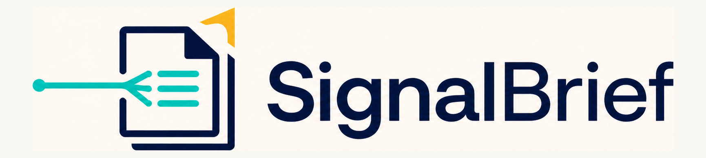

# SignalBrief



The research note is the durable source of truth, preserving evidence, nuance, and links. When Marp support is available, SignalBrief also creates a concise companion slide deck for rapid comprehension.

SignalBrief is a reusable, instruction-first workspace for AI-assisted research that remains useful after the chat ends. Start an AI session from this repository directory and paste a seed source, usually a webpage, article, blog post, or YouTube URL. The workspace instructions treat that source as a starting point, discover additional relevant sources, write a research note, and create a companion Marp deck where supported.

## Prerequisites

SignalBrief bundles its source-discovery, Marp-slide, and YouTube-transcript workflows locally in [`skills/`](skills/). They are project instructions, not external installs. On first use, the workflow checks the tools available in the active AI environment and uses the simplest available path.

- For slides, the bundled runner uses an existing public [Marp CLI](https://github.com/marp-team/marp-cli) when available. Otherwise, with approval where required, it runs `@marp-team/marp-cli` on demand through npm instead of requiring a permanent global install.
- For YouTube transcripts, an existing [yt-dlp](https://github.com/yt-dlp/yt-dlp) installation is preferred. Without it, the workflow tries `curl` plus Python 3 or a browser transcript view. Captions must exist and be accessible for extraction to work.
- For source discovery, the bundled Python 3 client checks `http://localhost:8080` by default or the optional `SEARXNG_URL` setting. When SearXNG is unavailable, it falls back to DuckDuckGo without starting Docker or installing a service.

### Advanced environment notes

AI tools differ in how they discover project-local skills. SignalBrief keeps the canonical instructions in [`skills/`](skills/). Codex desktop discovers the adapters in [`.agents/skills/`](.agents/skills/) when you open or start the session in the SignalBrief repository. Claude Code can use the repository-local [`.claude/skills/`](.claude/skills/) adapters where that convention is supported. Other tools may need to be pointed to the corresponding canonical file in `skills/`. If an environment needs package-install approval or blocks network access, the agent should surface that before the first on-demand Marp run. It only asks to install `yt-dlp` when it is needed and the built-in fallbacks cannot complete the extraction.

Optional self-hosting is for users who already want to run SearXNG. Configure its address with `SEARXNG_URL`; [`skills/searxng/settings/searxng-settings.yml.example`](skills/searxng/settings/searxng-settings.yml.example) is a localhost-safe starting point. SignalBrief never starts Docker or creates a local service automatically.

## First run

Start an AI session in this repository and say **“Set up SignalBrief.”** The bundled setup workflow checks source discovery, Marp, and YouTube transcript capabilities, reports available fallbacks, and surfaces any action that needs environment approval. It does not start Docker or install tools silently.

## Quick start

1. Choose or create a personal research home folder, for example `Research`.
2. Clone SignalBrief into that personal research home folder.
3. Start a preferred AI assistant in your research directory and paste a source, such as a webpage, article, blog post, or YouTube URL.
4. Where Marp is available, the workflow produces a concise companion slide deck beside the research note.

## What happens under the hood

SignalBrief is expected to select or create a topic-specific directory at the workspace root, then check relevant existing notes first. When research substantially overlaps, it extends or cross-links the existing material instead of creating a near-duplicate. It writes a dated, source-backed note and, where Marp is available, a companion deck beside it. Generated previews, downloads, and private working files stay out of version control. This is the intended workflow, not a database-level automatic deduplication guarantee.

## Two ways to learn from the same research

**New to the topic:** start with the deck for orientation, then read the full research note and follow its sources for evidence and detail.

**Already familiar with the topic:** use the deck as an efficient update on one specific area, then open the note only where you need context, methodology, or citations.

## Workspace template versus optional capabilities

The repository is the portable workflow and structure. It includes local source-discovery, Marp-slide, and YouTube-transcript workflows, but their external tools remain environment-dependent. The canonical instructions live in [`skills/`](skills/), while the lightweight Codex and Claude Code adapters point to them without duplicating implementation. If your tool uses another project-skill convention, point it to the corresponding file in `skills/` instead of installing a separate copy.

| Capability | What it enables | When it applies | How to obtain it | Fallback |
| --- | --- | --- | --- | --- |
| Source discovery | Searches for additional sources relevant to the seed material | Before authoring or extending a research note | Uses a reachable SearXNG instance at `localhost:8080` or `SEARXNG_URL` | DuckDuckGo instant-answer search |
| Marp slides | A companion Markdown slide deck and, where supported, rendered slides | After a research note is ready for a concise briefing | Use Marp support, an extension, or a skill available for your chosen AI environment | Keep a short slide outline in the note, or create a plain Markdown summary |
| YouTube transcripts | Searchable spoken content from a video | When a video is a research source | Use a transcript feature, service, or skill supported by your chosen AI environment | Cite the video and use available captions, notes, or other published sources |

## Workspace layout

```text
topic-name/
  topic-name.md
  topic-name-slides.md
sources/
skills/
  marp-slides/
  searxng/
  signalbrief-setup/
  youtube-transcript/
```
